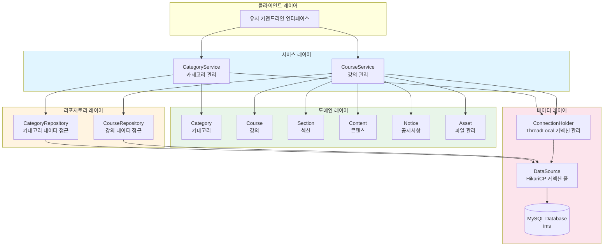

# 전체 시스템 아키텍처

LMS 시스템의 전체 레이어 구조와 컴포넌트 간의 관계를 보여줍니다.

## 아키텍처 다이어그램

## 레이어 설명

### 클라이언트 레이어
- 사용자와의 인터페이스를 담당
- 커맨드라인 기반 인터페이스

### 서비스 레이어
- 비즈니스 로직 처리
- 트랜잭션 관리
- CategoryService: 카테고리 관련 비즈니스 로직
- CourseService: 강의 관련 비즈니스 로직

### 리포지토리 레이어
- 데이터베이스 CRUD 작업
- SQL 쿼리 실행
- 데이터 접근 추상화

### 도메인 레이어
- 핵심 비즈니스 엔티티
- 도메인 규칙 및 검증 로직
- 불변성 보장

### 데이터 레이어
- 데이터베이스 연결 관리
- HikariCP를 통한 커넥션 풀링
- ThreadLocal을 이용한 Connection 관리

## 데이터 흐름

1. 클라이언트 요청 → 서비스 레이어
2. 서비스 레이어에서 Connection 획득 및 트랜잭션 시작
3. 도메인 객체 생성/조작
4. 리포지토리를 통해 데이터베이스 작업
5. 트랜잭션 커밋/롤백
6. 결과 반환

[← 목차로 돌아가기](./README.md)

