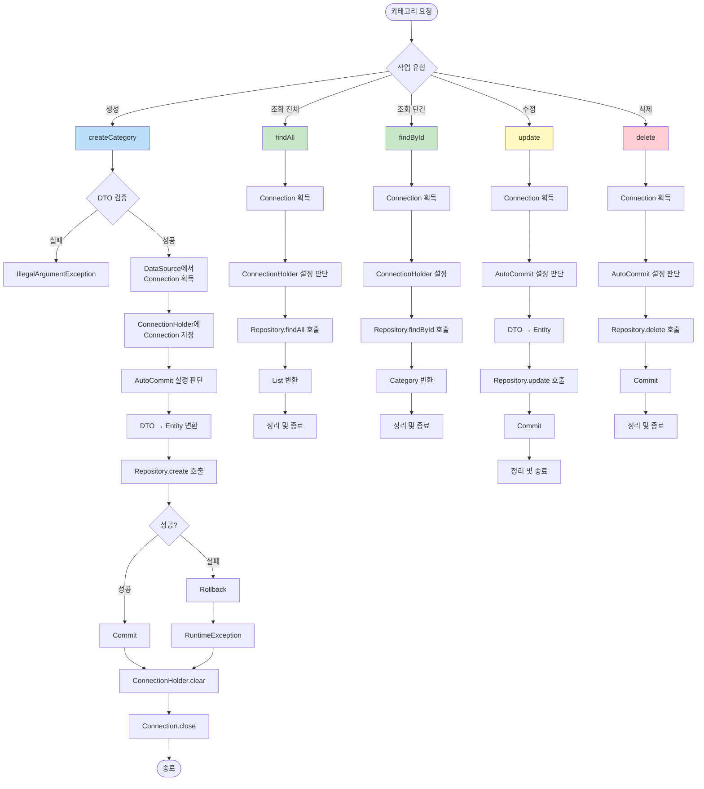

# 카테고리 관리 흐름

카테고리의 CRUD(생성, 조회, 수정, 삭제) 작업의 상세 흐름을 보여줍니다.

## 카테고리 관리 플로우차트

## 주요 작업 설명

### 1. 생성 (Create)
- DTO 유효성 검증
- Connection 획득 및 AutoCommit 비활성화
- DTO → Entity 변환
- Repository를 통해 DB 저장
- 트랜잭션 커밋 또는 롤백
- 리소스 정리

### 2. 조회 (Read)
- **전체 조회 (findAll)**: 모든 카테고리 목록 반환
- **단건 조회 (findById)**: ID로 특정 카테고리 조회
- 읽기 작업이므로 트랜잭션 커밋 불필요

### 3. 수정 (Update)
- Connection 획득
- DTO → Entity 변환
- Repository를 통해 업데이트
- 트랜잭션 커밋

### 4. 삭제 (Delete)
- Connection 획득
- Repository를 통해 삭제 실행
- 트랜잭션 커밋

## 에러 처리

- **IllegalArgumentException**: DTO 검증 실패 시
- **RuntimeException**: 데이터베이스 작업 실패 시
- 모든 실패 시나리오에서 Rollback 실행
- Finally 블록에서 Connection 정리 보장

[← 목차로 돌아가기](./README.md)

