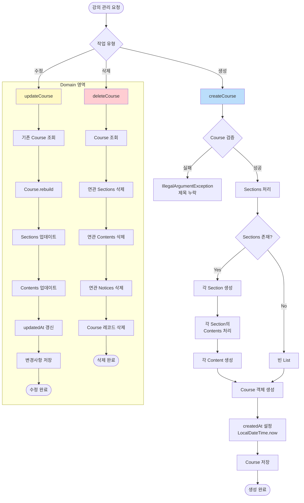

# 강의(Course) 관리 흐름

강의의 생성, 수정, 삭제 작업과 연관된 Section, Content, Notice의 처리 흐름을 보여줍니다.

## 강의 관리 플로우차트



## 주요 작업 설명

### 1. 강의 생성 (Create)
1. **검증 단계**
   - Course 제목 필수 확인
   - 유효성 검사 실패 시 `IllegalArgumentException` 발생

2. **Sections 처리**
   - Sections가 존재하면 각 Section 생성
   - 각 Section에 속한 Contents도 함께 생성
   - Sections가 없으면 빈 리스트로 처리

3. **Course 객체 생성**
   - 모든 하위 객체(Section, Content)와 함께 Course 생성
   - `createdAt`을 현재 시간(`LocalDateTime.now()`)으로 설정
   - 데이터베이스에 저장

### 2. 강의 수정 (Update)
1. 기존 Course 조회
2. `Course.rebuild()` 메서드로 객체 재구성
3. Sections 업데이트
4. Contents 업데이트
5. `updatedAt` 타임스탬프 갱신
6. 변경사항 저장

### 3. 강의 삭제 (Delete)
1. Course 조회
2. 연관된 모든 Sections 삭제
3. 연관된 모든 Contents 삭제
4. 연관된 모든 Notices 삭제
5. Course 레코드 삭제

**주의**: 삭제는 계층 구조를 따라 하위 요소부터 순차적으로 삭제

## 도메인 객체 계층 구조

```
Course
├── Section (1:N)
│   └── Content (1:N)
└── Notice (1:N)
```

## 검증 규칙

- **Course.title**: 필수 값 (null 불가)
- **Section.name**: 필수 값 (null 불가)
- **Section.seq**: 필수 값 (순서 번호)

[← 목차로 돌아가기](./README.md)

