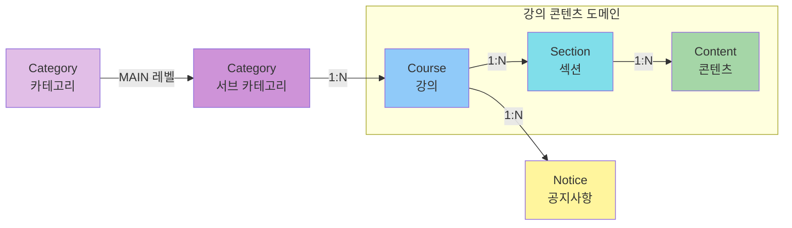

# 도메인 객체 관계도

LMS 시스템의 핵심 도메인 엔티티 간의 관계를 시각화합니다.

## 도메인 관계 다이어그램

## 엔티티 설명

### Category (카테고리)
- **계층 구조**: MAIN 레벨과 SUB 레벨의 2단계 구조
- **관계**: 부모-자식 관계 (self-referencing)
- **속성**:
  - `id`: 카테고리 ID
  - `name`: 카테고리 이름
  - `level`: 카테고리 레벨 (MAIN/SUB)
  - `parentId`: 부모 카테고리 ID (SUB인 경우)

### Course (강의)
- **관계**: 
  - SubCategory와 N:1 관계
  - Section과 1:N 관계
  - Notice와 1:N 관계
- **속성**:
  - `id`: 강의 ID
  - `title`: 강의 제목 (필수)
  - `summary`: 강의 요약
  - `detail`: 강의 상세 설명
  - `subCategoryId`: 소속 서브 카테고리 ID
  - `createdAt`: 생성 일시
  - `updatedAt`: 수정 일시

### Section (섹션)
- **관계**: 
  - Course와 N:1 관계
  - Content와 1:N 관계
- **속성**:
  - `id`: 섹션 ID
  - `name`: 섹션 이름 (필수)
  - `seq`: 순서 번호 (필수)

### Content (콘텐츠)
- **관계**: Section과 N:1 관계
- **속성**:
  - `id`: 콘텐츠 ID
  - `name`: 콘텐츠 이름
  - `seq`: 순서 번호
  - `body`: 콘텐츠 내용

### Notice (공지사항)
- **관계**: Course와 N:1 관계
- **속성**:
  - `id`: 공지사항 ID
  - (기타 속성)

## 관계 유형

### 1:N (일대다)
- 하나의 Course는 여러 Section을 가질 수 있음
- 하나의 Section은 여러 Content를 가질 수 있음
- 하나의 Content는 여러 Asset을 가질 수 있음
- 하나의 Course는 여러 Notice를 가질 수 있음
- 하나의 SubCategory는 여러 Course를 가질 수 있음

### 계층 구조
- **카테고리**: MAIN → SUB (2단계)
- **강의 콘텐츠**: Course → Section → Content (3단계)

## 도메인 규칙

1. **Category**
   - MAIN 카테고리는 parentId가 null
   - SUB 카테고리는 반드시 parentId를 가짐

2. **Course**
   - 반드시 SubCategory에 속해야 함
   - 코스는 Category로도,SubCategory로도도 조회가 가능해야함
   - title은 필수 값

3. **Section**
   - name과 seq는 필수 값
   - seq로 정렬되어 순서 유지

4. **Content**
   - Section 내에서 seq로 정렬
   - body에 실제 학습 콘텐츠 저장

[← 목차로 돌아가기](./README.md)

