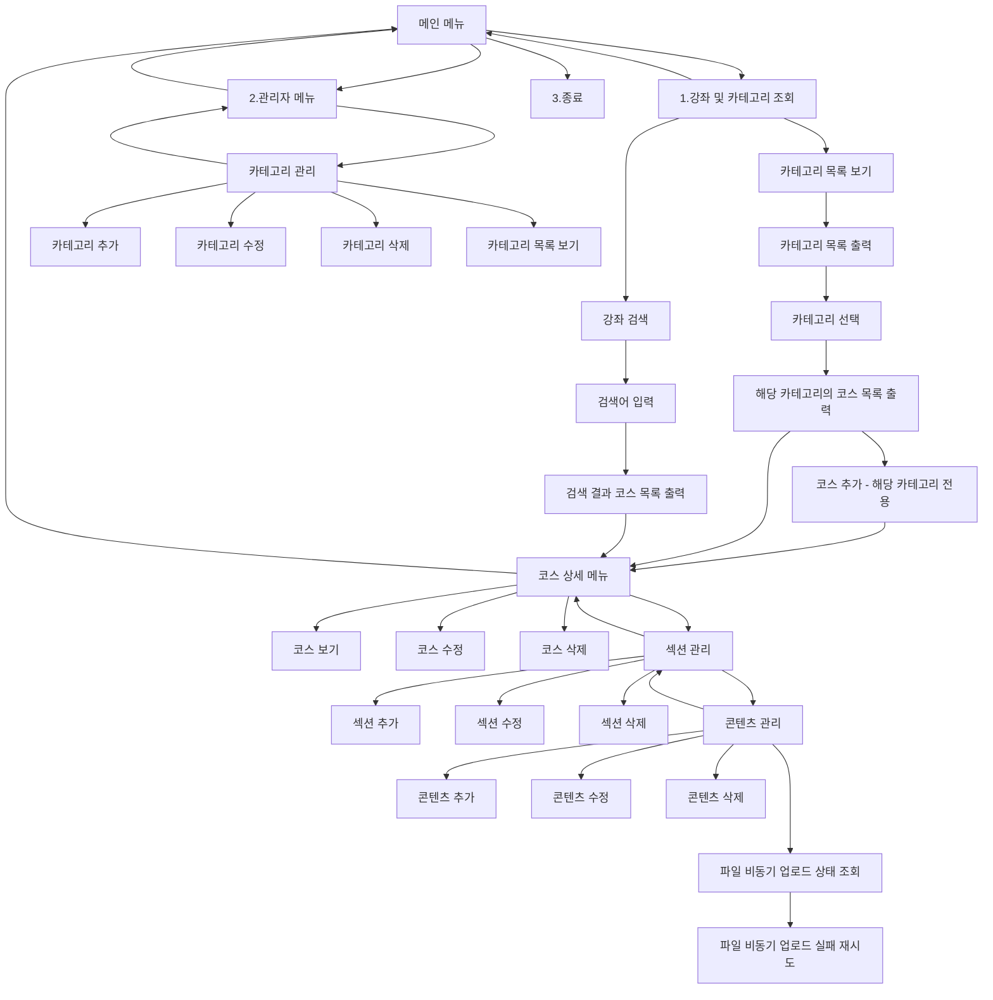

```mermaid
flowchart TD

%% 메인
A[메인 메뉴] --> B[1.강좌 및 카테고리 조회]
A --> Z[2.관리자 메뉴]
A --> X[3.종료]

%% 조회 메뉴
B --> C[카테고리 목록 보기]
B --> D[강좌 검색]
B --> A

%% 카테고리 조회
C --> C1[카테고리 목록 출력]
C1 --> C2[카테고리 선택]
C2 --> C3[해당 카테고리의 코스 목록 출력]
C3 --> C4[코스 추가 - 해당 카테고리 전용]
C4 --> E[코스 상세 메뉴로 이동]
C3 --> E

%% 강좌 검색
D --> D1[검색어 입력]
D1 --> D2[검색 결과 코스 목록 출력]
D2 --> E

%% 코스 상세 메뉴
E[코스 상세 메뉴] --> E1[코스 보기]
E --> E2[코스 수정]
E --> E3[코스 삭제]
E --> F[섹션 관리]
E --> A

%% 섹션 관리
F[섹션 관리] --> F1[섹션 추가]
F --> F2[섹션 수정]
F --> F3[섹션 삭제]
F --> G[콘텐츠 관리]
F --> E

%% 콘텐츠 관리
G[콘텐츠 관리] --> G1[콘텐츠 추가]
G --> G2[콘텐츠 수정]
G --> G3[콘텐츠 삭제]
G --> F


%% 관리자 메뉴
Z --> Z1[카테고리 관리]
Z --> A
Z1 --> Z11[카테고리 추가]
Z1 --> Z12[카테고리 수정]
Z1 --> Z13[카테고리 삭제]
Z1 --> Z14[카테고리 목록 보기]
Z1 --> Z

%% 파일업로드
G ---> AS1[파일 비동기 업로드 상태 조회]
AS1 --> AS2[파일 비동기 업로드 실패 재시도]

```
